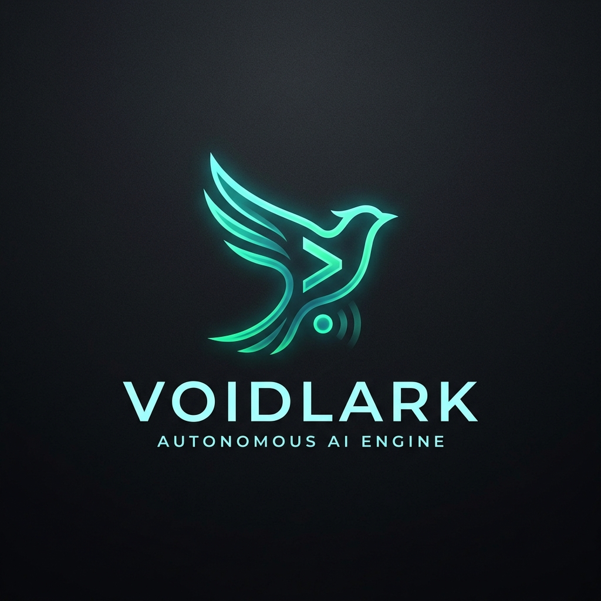

<div align="center">

# VOIDLARK

### Engine Layanan Pelanggan & Otomasi WhatsApp Berbasis AI: Durable, Auditable, dan Siap Production



[](https://nodejs.org/)
[](https://www.typescriptlang.org/)
[](https://github.com/WhiskeySockets/Baileys)
[](#database)
[](#pengujian)

**Durable Pipeline · Knowledge Retrieval · Claim Validator · Multi-Domain Matcher · Operator Handoff · Audit Trail**

[Mulai Cepat](#mulai-cepat) · [Fitur Utama](#fitur-utama) · [Arsitektur](#arsitektur) · [Konfigurasi](#konfigurasi) · [Deployment](#deployment)

</div>

---

## Filosofi System

Kebanyakan chatbot WhatsApp AI gagal di produksi bukan karena model AI kurang pintar, melainkan karena **arsitektur eksekusinya ringkih**: pesan hilang saat crash, status terputus, LLM berhalusinasi mengumbar janji palsu, dan operator manusia tidak bisa mengambil alih saat terjadi situasi kritis.

**Voidlark** dibangun dengan pendekatan *systems engineering* untuk menangani transaksi bisnis nyata via WhatsApp:

1. **Durable Message Pipeline**: Setiap pesan masuk disimpan ke antrean persisten. Pesan dideduplikasi, diurutkan secara ketat per-JID (kontak), diberi eksklusivitas *lease*, di-retry dengan *exponential backoff + jitter*, dan dialihkan ke *dead-letter queue* bila gagal permanen.
2. **Policy Engine & Claim Guard**: AI dibatasi oleh *Universal Claim Validator* yang mengontrol klaim durasi, garansi, spesifikasi, dan harga. Menghentikan halusinasi AI sebelum menyentuh layar pelanggan.
3. **Decoupled Architecture**: Logika domain (katalog, jam kerja, alur checkout, ongkos kirim, consent) diisolasi dalam konfigurasi dan database — bukan di-hardcode dalam prompt atau source code core logic.
4. **Deterministic Operator Handoff**: Saat konteks membutuhkan penanganan manusia (klaim garansi, komplain berat, permintaan khusus), bot beralih mode secara instan dan menyerahkan kontrol penuh ke antrean operator Admin UI dengan audit trail lengkap.

> [!IMPORTANT]
> Voidlark memanfaatkan koneksi WhatsApp Web via Baileys engine. Pengguna wajib mematuhi aturan platform, menjaga consent pelanggan, dan menerapkan rate limiting anti-ban secara bertanggung jawab.

---

## Fitur Utama

### 1. Percakapan & AI Safeguards
* **OpenAI-Compatible Engine**: Kompatibel dengan OpenAI SDK, gateway lokal (Ollama, vLLM), OpenRouter, maupun provider cloud (Gemini, DeepSeek, Claude).
* **Universal Claim Validator**: Membatasi klaim durasi, lisensi, garansi, dimensi, dan harga untuk mencegah instruksi berhalusinasi.
* **Citation Visualizer**: Menampilkan evidence data & sumber rujukan secara nyata di Sandbox Admin UI untuk verifikasi transparansi grounding data.
* **Universal Domain Matcher**: Algoritma pencocokan domain otomatis untuk katalog *Digital*, *Fashion*, *Elektronik*, *Parfum*, dan *Umum*.
* **Structured Tool Calling**: Integrasi fungsi otomatis untuk kalkulasi ongkir, pembuatan draft order, verifikasi pembayaran, lookup Tavily/Brave, dan eskalasi handoff.

### 2. Penjualan & Operasional Bisnis
* **Consultative & Direct Checkout Flow**: Mendukung alur tanya-jawab produk hingga pencatatan data pembeli (Nama, No HP, Alamat lengkap).
* **Multi-Courier Shipping**: Kalkulasi ongkos kirim otomatis via API RajaOngkir / Komerce.
* **Multi-Number WhatsApp Engine**: Manajemen rotasi lead lintas nomor WhatsApp (Round Robin, Least Busy, Sticky Assignment).
* **Anti-Ban Protection**: Jeda waktu acak (*Anti-Ban Delay*) dan simulasi waktu mengetik (*typing indicator*) yang proporsional sesuai panjang pesan.
* **Consent & Suppression Management**: Penanganan otomatis keyword opt-out (misal: *STOP*) dan re-opt-in sesuai regulasi privasi.

### 3. Engine Durable Queue & Message Outbox
* **Per-JID Concurrency Lock**: Menjamin urutan balasan per kontak pelanggan tanpa mengunci pemrosesan kontak lain secara paralel.
* **Outbound Outbox Pattern**: Lacak status pengiriman secara presisi (`queued` → `sending` → `sent` → `delivered` → `read` → `failed` → `dead_letter`).
* **Retry & Dead-Letter Recovery**: Penanganan otomatis kegagalan jaringan dengan opsi retry manual via Dashboard Operasional.

### 4. Knowledge Ingestion & Media Processing
* **Multi-Format Ingestion**: Ekstraksi otomatis dari file `.txt`, `.md`, `.pdf`, `.docx`, `.xlsx`, `.csv`, serta `.png`/`.jpg` (via OCR Tesseract).
* **Atomic Corpus Activation**: Ingestion versi baru diolah secara terpisah; corpus lama tetap melayani traffic hingga versi baru lulus validasi checksum dan siap diaktifkan secara atomic.
* **Evidence-Based Lexical Retrieval**: Chunking berbatas metadata untuk pencarian context yang presisi tanpa distorsi kata kunci.

### 5. Observabilitas & Keandalan Enterprise
* **Dual Database Driver**: Mendukung SQLite (dengan WAL mode & busy timeout) untuk deployment hemat resource, dan PostgreSQL untuk kebutuhan skala enterprise.
* **Append-Only Audit Trail**: Setiap tindakan sistem, mutasi transaksi, dan perubahan konfigurasi tercatat secara konstan.
* **Automated Database Backup**: Backup terjadwal dengan checksum verification, fungsi retention rotasi otomatis, dan *restore drill command*.
* **Prometheus Metrics & Health Checks**: Endpoint `/health/live`, `/health/ready`, `/health`, dan `/metrics` untuk pengawasan real-time.

---

## Tampilan Operasional

Dashboard Admin UI dibangun menggunakan server-rendered Express yang ringan, responsif, dan siap guna tanpa dependensi build step frontend yang rumit.

| Modul | Fungsi Utama |
| :--- | :--- |
| **Ringkasan** | Dashboard KPI lead, status antrean pesan, kesehatan WhatsApp, dan alert kritis |
| **Profil & Alur** | Pengaturan identitas bisnis, checkout fields, kurir shipping, SLA, dan consent |
| **Gaya Balasan** | Visual Prompt Builder, manajemen preset gaya, validator, dan simulator balasan |
| **Katalog & Informasi** | Management ingestion Knowledge Base, status chunking, dan retry job |
| **Simulasi Percakapan** | Sandbox pengujian prompt & tool calling AI tanpa mengirim pesan WhatsApp nyata |
| **Calon Pelanggan & Pesanan**| CRM ringkas pelacakan lead, status pembayaran, dan riwayat pesanan |
| **Handoff Operator** | Manajemen antrean penanganan manusia, SLA timer, assignment, dan resolusi |
| **Manajemen WhatsApp** | Rotasi multi-nomor, kuota per nomor, jeda anti-ban, dan queue rate-limiter |
| **Koneksi System** | Health detail, backup/restore manager, log viewer, dan pengujian API |

---

## Arsitektur System

```mermaid
flowchart TD
    subgraph Ingress ["Layer Masuk & Durable Queue"]
        WA[WhatsApp Web / Baileys Engine] -->|Event upsert| IQ[(Inbound Message Queue)]
        IQ -->|Deduplicate & Lease| Worker[Per-JID Sequential Worker]
    end

    subgraph Core ["Logic & Control Layer"]
        Worker --> Check[Consent & Business Hours Guard]
        Check --> Policy[Policy Engine & Claim Validator]
        Policy --> KB[Knowledge Base Lexical Retrieval]
        KB --> AI[OpenAI-Compatible AI Gateway]
        AI --> Tools{Execution Tools}
        Tools -->|Kalkulasi Ongkir| Ship[Shipping API]
        Tools -->|Simpan Lead / Order| DB[(Database SQLite / Postgres)]
        Tools -->|Handoff Manusia| Admin[Admin Operator Queue]
    end

    subgraph Egress ["Layer Keluar & Tracking"]
        AI -->|Generate Response| OQ[(Outbound Outbox Queue)]
        OQ -->|Simulasi Anti-Ban Delay| WA
        WA -->|Status Ack| Status[Sent / Delivered / Read Track]
        Status --> DB
    end

    subgraph Management ["Observability & Interface"]
        UI[Express Admin UI] <--> DB
        UI <--> Management
        Metrics[Prometheus /metrics & /health] <--> Core
    end
```

---

## Tech Stack

| Layer | Komponen & Teknologi |
| :--- | :--- |
| **Runtime & Core** | Node.js 24, TypeScript (ESM), Native `tsx`, Express 5 |
| **WhatsApp Engine** | `@whiskeysockets/baileys` |
| **AI Integration** | OpenAI SDK & HTTP OpenAI-Compatible API |
| **Database & Persistensi** | SQLite (Node.js Native `node:sqlite`) / PostgreSQL (`pg`) |
| **Knowledge Engine** | `pdf-parse`, `mammoth`, `xlsx` (SheetJS), `tesseract.js` |
| **Logging & Security** | Pino Structured Logger, Helmet, CSRF Protection, Rate Limiting, Fetch Metadata |
| **Observability** | Prometheus Exposition Format, Native Health Endpoints, Pino Redaction |
| **Deployment** | Docker Multi-Stage, Docker Compose, GitHub Actions CI |

---

## Mulai Cepat

### 1. Prasyarat System
* Node.js v24.0.0 atau yang lebih baru
* npm v10.0.0+
* Endpoint AI (Local Ollama/vLLM, OpenRouter, OpenAI, atau Gemini API)

### 2. Instalasi Dependency
```powershell
npm install
```

### 3. Konfigurasi Environment
Salin template environment `.env.example`:
```powershell
Copy-Item ".env.example" ".env"
```

Isi konfigurasi dasar `.env`:
```dotenv
DB_DRIVER=sqlite
SQLITE_PATH=./data/voidlark.db
AI_API_BASE_URL=http://localhost:20128/v1
AI_API_KEY=your_api_key
AI_MODEL=gemini/gemini-2.5-flash
ADMIN_PASSWORD=password-super-aman-minimal-16-karakter
HOST=127.0.0.1
PORT=3000
```

### 4. Jalankan Server Development
```powershell
npm run dev
```

Terminal akan menampilkan port aktif dan URL akses Admin UI:
```text
[INFO] Admin web aktif: http://127.0.0.1:3000/admin
```

### 5. Hubungkan WhatsApp
1. Buka browser dan login ke `http://127.0.0.1:3000/admin`.
2. Masukkan `ADMIN_PASSWORD` yang dikonfigurasi.
3. Buka menu **Manajemen WhatsApp** atau lihat terminal untuk melakukan **Scan QR Code**.
4. Setelah terhubung (status `open`), uji balasan menggunakan **Simulasi Percakapan**.

---

## Konfigurasi Environment

Daftar variabel lingkungan utama yang didukung Voidlark:

| Variabel | Wajib | Default | Deskripsi |
| :--- | :---: | :--- | :--- |
| `DB_DRIVER` | No | `sqlite` | Opsi database: `sqlite` atau `postgres` |
| `SQLITE_PATH` | Ya (SQLite) | `./data/voidlark.db` | Path penyimpanan file database SQLite |
| `DATABASE_URL` | Ya (Postgres)| - | Connection string PostgreSQL |
| `AI_API_BASE_URL` | Ya | `http://localhost:20128/v1` | Base URL endpoint AI OpenAI-compatible |
| `AI_API_KEY` | Ya | - | Credential API Key provider AI |
| `AI_MODEL` | Ya | - | Name/ID model AI yang digunakan |
| `ADMIN_PASSWORD` | Ya | - | Password login Admin UI (min. 16 karakter di production) |
| `RAJAONGKIR_API_KEY` | Optional | - | API Key RajaOngkir/Komerce untuk kalkulasi ongkir |
| `TAVILY_API_KEY` | Optional | - | API Key Tavily Search untuk web lookup eksternal |
| `DB_BACKUP_ENABLED` | No | `true` | Mengaktifkan scheduler backup otomatis |
| `DB_BACKUP_RETENTION` | No | `14` | Jumlah simpanan backup terbelakang yang dipertahankan |
| `INBOUND_CONCURRENCY`| No | `3` | Batas maksimum worker pemrosesan pesan paralel |

---

## Pengujian (Test Suite)

Voidlark dilengkapi dengan test suite yang komprehensif, deterministik, dan bebas resource leak.

```powershell
# Jalankan seluruh test suite (153 tests)
npm test

# Jalankan type checking dan verifikasi build dist
npm run build
```

### Cakupan Verifikasi Test (153 Passing Tests):
* **Security & Auth Guard**: Validasi CSRF, sanitasi session cookie, rate limiter, dan proteksi password.
* **Pipeline Integrity**: Deduplikasi antrean, penanganan transaksi berurutan per-JID, eksklusivitas lease, dan penanganan *dead-letter*.
* **AI Policy Engine**: Validasi claim validator, sanitasi prompt injection, dan universal domain matcher.
* **Knowledge Retrieval**: Accuracy test chunking, checksum dedupe, dan *atomic corpus activation*.
* **Database & Migration**: Transaksi savepoint, idempotensi skema migrasi, dan portabilitas SQLite/Postgres.
* **Multi-Number WhatsApp Rotation**: Pengujian algoritma alokasi lead (*Round Robin*, *Least Busy*, *Sticky Assignment*).
* **Backup & Restore Drill**: Verifikasi integritas checksum backup, pencegahan restore korup, dan automatisasi rotasi file.

---

## Deployment Production

### Menggunakan Docker Compose (Direkomendasikan)

1. Pastikan `.env` production sudah disesuaikan dengan credential aman.
2. Jalankan perintah containerization:

```powershell
docker compose up -d --build
```

3. Verifikasi kontainer dan status layanan:
```powershell
docker compose ps
Invoke-RestMethod "http://127.0.0.1:3000/health/ready"
```

Volume terisolasi secara otomatis dibuat untuk menjaga data sensitif:
* `voidlark_data`: Database SQLite / data runtime
* `voidlark_backups`: Arsip backup terenkripsi & terjadwal
* `voidlark_kb`: Dokumen Knowledge Base bisnis

---

## Keamanan & Praktek Terbaik

1. **Proteksi Admin UI**: Jangan mengekspos port Admin UI langsung ke internet publik tanpa HTTPS reverse proxy (Nginx / Caddy / Cloudflare Tunnel) dan autentikasi tambahan.
2. **Keamanan Kredensial**: Rotasi API Key dan `ADMIN_PASSWORD` secara berkala. Hindari menyimpan secret di repositori Git.
3. **Data Privacy**: PII (Personally Identifiable Information) pelanggan secara otomatis di-redact dari structured log Pino.
4. **Isolasi Sesi**: Jangan menjalankan dua instance Voidlark menggunakan sesi nomor WhatsApp yang sama untuk menghindari konflik status WebSocket Baileys.

---

## Struktur Repositori

```text
cs-automation/
├── src/
│   ├── admin/          # Express Admin UI, auth session, CSRF, operator view
│   ├── ai/             # Agent logic, tool validation, policy engine, claim validator
│   ├── api/            # Integrasi eksternal (RajaOngkir, Tavily, Brave)
│   ├── chat/           # Business hours, consent, handoff workflow, lead management
│   ├── config/         # Database drivers, migrations, backup storage, logger
│   ├── operations/     # Health check, readiness gates, Prometheus metrics
│   ├── payments/       # Payment lifecycle & webhook handler
│   ├── whatsapp/       # Baileys engine wrapper, inbound queue, outbox worker
│   └── index.ts        # Bootstrap entrypoint & graceful shutdown
├── tests/              # 153 deterministic test suite files
├── docs/               # Dokumentasi operasional & asset brandkit
│   ├── assets/         # Visual assets & brandkit diagrams
│   └── operations.md   # Incident runbook & operational manual
├── .project/           # PRD, CHANGELOG, dan NEXTPLAN proyek
├── business.config.json # Konfigurasi profil & alur bisnis aktif
└── compose.yml         # Container production deployment spec
```

---

<div align="center">

**VOIDLARK** — *Engine Otomasi WhatsApp Berorientasi Sistem: Resilien, Terukur, dan Terkendali.*

</div>
